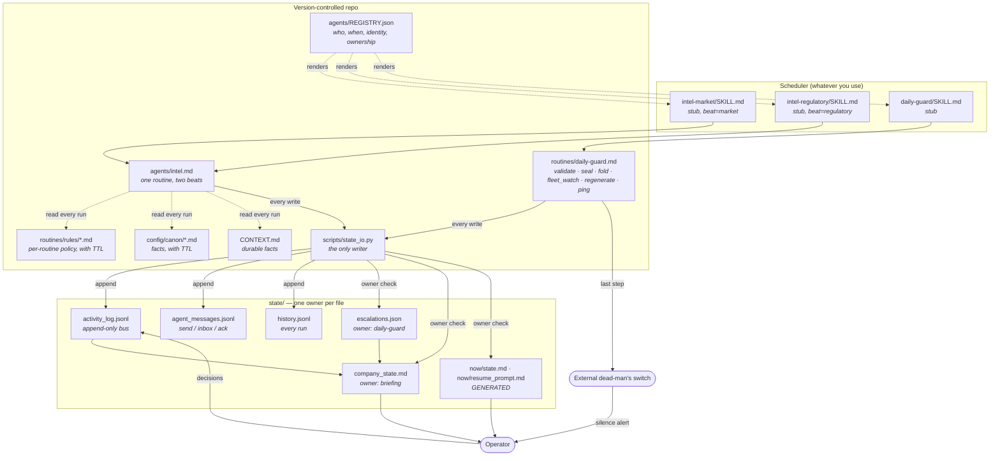
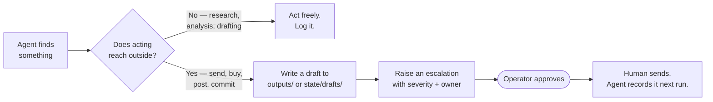
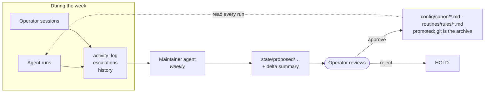

# agentic-ops-template

A template for running a fleet of scheduled AI agents as an operating company, rather than as a pile of disconnected automations.

The hard part of a multi-agent system is not the agents. It is everything around them: how they share state, how they escalate, how the operator stays in the loop without becoming the bottleneck, and how the rules they follow stay current as the business changes. This repo is the scaffolding for that, extracted from a fleet that has been running daily in production.

It ships empty. Every file is a pattern with placeholders, not a configuration to inherit.

---

## The problem this solves

A single scheduled agent is easy. Ten of them is a different thing:

- Agent A discovers something Agent B needed to know two hours ago.
- The operator asks "what happened overnight?" and the honest answer requires reading nine log files.
- Every agent re-derives the same company facts from raw sources, and they drift apart.
- A rule the operator stated in a chat session dies when the session ends.
- Prompts live inside a scheduler UI where they cannot be diffed, reviewed, or rolled back.
- An agent quietly starts doing something you did not authorise, and nobody notices for a week.

Each of those is a coordination failure, not a capability failure. The patterns below are the fixes.

---

## Architecture at a glance



Eleven patterns hold it together. Each is independently useful; together they are the system. Patterns 1 to 7 are the coordination and integrity layer. Patterns 8 to 11 were added after the fleet this is extracted from had run for several months; each fixes a failure the first seven let through.

---

## Pattern 1 — The state bus

**Problem:** agents cannot see each other. Without a shared surface they duplicate work, contradict each other, and act on stale facts.

**Solution:** one append-only log that every agent writes after every run and reads before every run.

`state/activity_log.json` is a list of entries, newest first:

```json
{
  "timestamp": "2026-01-15T14:30:00Z",
  "agent": "market-monitor",
  "run": 42,
  "action": "One-line summary of what this run did",
  "details": "Numbers, file paths, identifiers. Other agents reason from this field, so put the specifics here.",
  "affects": ["outreach", "procurement"],
  "decisions": [
    "chose X over Y because Z",
    "escalated rather than acting, because the threshold was ambiguous"
  ]
}
```

Three fields carry most of the weight:

- **`details`** is where the numbers go. An entry that says "scanned the market, found nothing" is worthless to the next agent. One that says "scanned 6 sources, 2 listings above threshold, both missing lead-time data, logged as incomplete" is actionable.
- **`affects`** is a routing hint. An agent scanning the log can filter to entries naming it.
- **`decisions`** is the audit trail. One or two judgment calls per run, in the form "chose X over Y because Z". This is what you diff after a model upgrade to see whether behaviour shifted. It costs almost nothing to write and it is the only cheap way to detect drift.

### The bus is two-way

This is the part most implementations miss. **Interactive sessions must write to the log too.**

If you have a conversation with an agent and it produces a real outcome — a document reaches send-ready state, you set a price, you commit to a deadline, you change an agent's instructions — that outcome exists only in a chat transcript unless something writes it down. The scheduled fleet reads the bus every run and will never see it.

The rule, stated as a standing instruction in every session:

> Any session that produces a consequential outcome MUST, before ending, prepend a schema-matched entry to `state/activity_log.json` and save deliverables under `outputs/<workstream>/`, not only in chat. If the session cannot reach the folder, output the ready-to-paste entry as its final message.

Without it you get one-way drift: sessions read fleet state and act on it, the fleet never learns what the sessions decided, and the two views of reality separate silently.

### Companion files

| File | Shape | Purpose |
|---|---|---|
| `state/activity_log.json` | JSON array, newest first | The bus. Cross-agent coordination. |
| `state/history.jsonl` | JSONL, append-only | Every run, including no-ops. Cheap and complete. Routine status goes here, not in escalations. |
| `state/escalations.json` | JSON array | Things needing a human. Severity + status + owner. |
| `state/company_state.md` | Markdown | Synthesized brief. See Pattern 3. |

Keep `history.jsonl` separate from `activity_log.json`. The log is for coordination and should stay readable; the history is for forensics and grows without bound. Rotate the history, never the log's recent window.

The array-and-prepend bus above is the simplest thing that works for two or three agents. Once several agents write it, a prepend is a whole-file rewrite by each of them, and Pattern 8 moves the bus to an append-only `activity_log.jsonl` with the same entry shape. The helper that does that also takes over the message-passing that `affects` only hints at: `state/agent_messages.jsonl`, with send, inbox and ack.

---

## Pattern 2 — Escalate, do not act

**Problem:** an autonomous agent that can act is an agent that can act wrongly, at 3am, unsupervised, in your name.

**Solution:** agents that touch money, external communication, or public surfaces run in OBSERVE mode. They research, evaluate, and draft. They do not send, buy, post, or commit.



Encode it as hard rules in the standing prompt, phrased as absolutes:

```
1. NEVER send external communications without human approval. Draft to state/drafts/.
2. NEVER post to public channels directly. Draft to outputs/content/.
3. NEVER make purchases or financial commitments.
4. DO research aggressively and autonomously.
5. DO draft and queue for review.
6. DO monitor continuously.
7. DO update state after every run.
8. ESCALATE uncertainty rather than guessing.
9. LOG everything.
```

Rules 4 through 6 matter as much as 1 through 3. An agent that escalates everything is as useless as one that acts on everything; the goal is a clean line, not caution everywhere.

### Escalation hygiene

Escalations are for things that need a decision. A cycle summary is not an escalation. If everything is escalated, the operator stops reading, and the one that mattered gets missed.

Define the escalation triggers explicitly in the standing prompt: a deal meets pre-agreed criteria, a regulatory change lands, a counterparty replies, a deadline falls inside a window, content is ready to publish, or the agent genuinely cannot tell whether it should act. Everything else goes to `history.jsonl`.

**Backpressure.** Add a gate: if more than N items are already awaiting approval, the agent stops generating new ones and says so. Without it, a drafting agent will happily produce two hundred drafts nobody has read. The gate should be stated as a number the agent checks before drafting, with a named exception for genuinely time-sensitive items.

---

## Pattern 3 — The synthesized brief

**Problem:** every agent reading the raw log every run means every agent re-derives the same picture, spends tokens doing it, and reaches slightly different conclusions.

**Solution:** one agent, once a day, reads everything and writes the picture down. Everyone else reads that first.

`state/company_state.md` is maintained by the briefing agent and holds:

- Current priorities, with owners
- Active workstreams and their status
- **Canonical facts** — the numbers that must not drift. Whatever your equivalents are of headcount, budget, key dates, current version numbers.
- Open blockers
- What changed in the last 24 hours

Then every other agent's prompt opens with:

> Begin each run by reading `state/company_state.md`. It is the shared picture of where things stand. Read it first, then scan `state/activity_log.json` for anything since it was written.

Two effects. Agents stop carrying stale numbers, because there is one place the number lives. And the operator gets a readable digest as a side effect of a thing the fleet needed anyway.

The briefing agent is also the natural place to fold in operator decisions from interactive sessions, so they reach the fleet within a day rather than never.

---

## Pattern 4 — Pointer stubs

**Problem:** scheduler UIs store the prompt inside the task. That means the prompt cannot be diffed, reviewed, or rolled back, and any session that cannot reach the scheduler's storage cannot edit it. If you keep a copy in git for reviewability, you now have two copies, and they drift.

**Solution:** invert it. The repo holds the real prompt. The scheduled task holds a pointer.

`agents/_pointer-stub.md` is the pattern. The live task file becomes:

```markdown
---
name: <task-id>
description: <preserved verbatim from the original task>
---

This agent's canonical prompt lives at `<ABSOLUTE_PATH>/agents/<task-id>.md`. Read that file now and execute it as your complete instructions for this run. If the file is unreachable, write a CRITICAL escalation to `<ABSOLUTE_PATH>/state/escalations.json` describing the failure and stop without doing other work.
```

Three details that are not optional:

1. **Preserve the frontmatter verbatim.** Schedulers key off `name` and display `description`. Rewriting them changes what the task looks like in the UI.
2. **Include the failure branch.** A stub that silently no-ops when the file is missing looks exactly like a healthy quiet run. You will not notice for weeks.
3. **Use an absolute path.** The agent's working directory is whatever the scheduler decides.

Now prompt changes are commits. They diff, they review, they revert, and any session that can reach the repo can make them.

### The drift-check duty

Editing a task through the scheduler UI will overwrite the stub with a full prompt and silently re-fork the two copies. Assume this will happen, and check for it on a schedule:

```bash
for d in <TASK_DIR>/*/; do
  id="${d%/}"; f="$id/SKILL.md"
  n=$(wc -l < "$f" | tr -d ' ')
  if [ "$n" -gt 10 ] || ! grep -q "agents/$(basename $id).md" "$f"; then
    echo "DRIFT: $id ($n lines)"
  fi
done
```

`scripts/registry_stubs.py check` is the registry-aware form of this loop (Pattern 9). It also catches a stub that points at the wrong routine or beat, a registered agent with no stub at all, and a scheduled task the registry does not know about.

**Do not auto-re-stub.** A grown file is somebody's real edit and is the only copy of it. Diff it against the canonical, escalate, and let a human decide what merges back. Auto-repair here destroys work.

---

## Pattern 5 — Standing rules, and the loop that keeps them current

**Problem:** the rules an agent must follow are not in the agent. They are in the business, and the business changes weekly. Editing twelve prompts every time a rule changes does not happen, so the prompts rot.

**Solution:** separate the standing rules from the task instructions, and give the rules their own maintenance loop.



The standing rules hold what every agent needs and no agent should restate: role, operating mode, workstreams and priorities, cross-agent awareness, anti-patterns, voice and vocabulary discipline, source-verification rules, cadence. In the first version of this template that was one file. Pattern 11 splits it into canon notes, per-routine rules files and generated tiers; `config/strategy_prompt.TEMPLATE.md` is now the index that says where each part lives.

`routines/maintainer.md` is the agent that keeps it fresh. Once a week it reads the log, the escalations, the briefings, and the agent prompts, identifies what changed, and writes **proposed** edits plus a delta summary. It never edits a canonical file. The operator promotes.

Four rules make this work rather than generate noise:

- **Surgical edits, not rewrites.** Most weeks are small. Do not rewrite sections that did not change.
- **HOLD is a valid output.** A week with no material deltas gets no proposals. Churn for its own sake burns the operator's review attention, which is the scarcest resource in the system.
- **Cite the source for every delta.** "Added rule X because incident Y on date Z." A proposal you cannot trace is a proposal you cannot evaluate.
- **The operator promotes, never the agent.** Promotion is a deliberate copy by the operator; git is the archive.

### Anti-patterns are the memory

The most valuable section of the standing prompt is a numbered, append-only list of specific mistakes and their corrections. Not "be accurate" — the actual failure, the actual rule.

Generic form, with a real shape:

> **#N. Quoting a metric from a state file without reconciling it against the source of record.** [What happened, in one sentence, with the magnitude of the error.] **Rule:** before any metric enters an external document, reconcile the stored value against its source and state which convention is in use.

Numbered so agents can cite them ("held this draft under #N"). Append-only so the numbering stays a stable reference. Each one is a scar, and the list is the only part of the system that gets monotonically more valuable. It lives in its own canon note, `config/canon/anti-patterns.md`, so it can be loaded without the rest.

### Keeping the human-facing prompt in sync

If you also maintain a resume prompt — the block you paste into a fresh interactive session so it loads standing rules immediately — it drifts from the agent-facing rules unless something syncs it.

The first version of this template gave the maintainer a list of triggers for when to re-sync it. That was not enough. The prompt still drifted, because a sync step a model may skip is a request, not an invariant. Pattern 11 generates the resume prompt from canon every morning instead, so there is nothing to sync and nothing to skip.

---

## Pattern 6 — Source-of-truth precedence

**Problem:** four files disagree about the same fact and each agent picks a different one.

**Solution:** a written, ordered precedence, plus one rule about what agents must never do.

1. The operator's direct words in the current session
2. Written captures of operator decisions from interactive sessions
3. The durable context document (`CONTEXT.md` or equivalent)
4. Long-form memory files
5. State files, agent outputs, briefings

Higher wins. Within a tier, newer wins.

The rule that matters: **an agent must never "correct" a newer operator decision against older canon.** A capture that contradicts the context document is newer intent with the canon pending update, not an error to be fixed. Agents flag the conflict; they do not revert it. Without this rule, a diligent agent will helpfully undo the operator's most recent decision and cite the documentation while doing it.

The maintainer loop closes the gap: captures get merged into canon weekly and marked as merged, so the precedence list stays short in practice.

---

## Pattern 7 — Guard nodes and the audit chain

**Problem:** the failure mode that actually hurts is not an agent that errors. It is an agent that succeeds with a wrong value, which then flows through the bus into every downstream decision. And when a number is wrong in your canonical context, freshness checks do not help: the wrong value is brand new.

**Solution:** two small scripts with no dependencies, run on a schedule.

**`scripts/validate_state.py`** is the guard node. It checks three classes of invariant that are nearly free to assert and catch most confidently-wrong values:

- **Shape.** Every load-bearing state file parses, recent log entries carry their required fields, enum fields hold known values.
- **Magnitude.** Key metrics may not move more than ±25% between checks, and may not fall below a floor they genuinely cannot reach. A test suite does not shrink 91% overnight; a parse bug does that.
- **Monotonicity.** Run counters only go up. A counter that went backwards is a sync failure, not history.
- **Write-back.** The logging step at the end of every agent is a *request* in the prompt, and a weaker or hurried model completes the work and silently skips it. The guard turns the request into an enforced invariant: entries that identify no agent, agents present in the bus today but absent from the run history, and agents silent beyond three times their own observed cadence. Cadence is measured over distinct active days, so an agent that writes several lines per run is not mis-measured, and the partial-write-back check applies only to identities that have logged before, so interactive sessions are excluded without anyone maintaining an exemption list.

The baseline updates only for values that passed, so a bad value cannot poison the next comparison. Findings are escalated, never auto-corrected — the source of record is reconciled by a human, because the guard cannot know which side is wrong.

One design rule matters more than the checks themselves: **a guard that cries wolf gets ignored, which is worse than no guard.** The first version of this one produced four false positives on real data, because the log had grown two identity conventions and three timestamp keys over time. The fix was to normalise the variance and report it once as a NOTE that does not drive the exit code, rather than emit hundreds of findings. Separate the lines that demand action from the lines that are merely true.

This pattern earned its place the hard way: the fleet this template is extracted from shipped a metric at 9% of its true value into its canonical context file, through an automated sync, with a fresh timestamp. A staleness check passed it. A magnitude check would have stopped it in the same second.

**`scripts/audit_chain.py`** makes the decision log tamper-evident. Every activity-log entry is sealed into an append-only SHA-256 hash chain — each record links to the previous, so any later mutation, deletion, or reordering of sealed history breaks verification from that point forward. `seal` is idempotent and runs from the daily guard (`routines/daily-guard.md`); `verify` proves the chain in milliseconds and its output is something you can hand to an auditor.

Be precise about what the chain proves: that the recorded history has not been altered since sealing. It does not prove an entry was *true* when written — that is what the source-citation rules in the standing prompt are for. The two compose: citations make entries trustworthy going in, the chain keeps them trustworthy afterwards. See `GOVERNANCE.md` for how this maps to record-keeping expectations in common compliance frameworks, and for the claims you should not make.

---

## Pattern 8 — Single-writer state

**Problem:** when every agent may write every file, nothing locks. Agents defend themselves by copying the whole file before each write, the state directory fills with backups, and the writes still collide. The fleet this template is extracted from reached that point with its three most-shared files: several agents writing each, hundreds of pre-write copies totalling over a hundred megabytes, and no protection anywhere. Two smaller failures ride along. The model types the timestamp, and one run was stamped nine hours in the future, which broke every liveness check built on the log. And the model counts its own run number, and counts wrong.

**Solution:** one owner per state file, enforced by the only code path that writes state.

The map lives in `agents/REGISTRY.json`:

```json
"state_files": {
  "state/history.jsonl":        {"mode": "append-only",   "owner": "all"},
  "state/agent_messages.jsonl": {"mode": "append-only",   "owner": "all"},
  "state/escalations.json":     {"mode": "single-writer", "owner": "daily-guard"},
  "state/market_state.json":    {"mode": "single-writer", "owner": "intel"},
  "state/legacy.json":          {"mode": "frozen",        "owner": null}
}
```

`scripts/state_io.py` is the helper, and agents are told to use nothing else. What it enforces:

- **Owner check.** `write_state()` refuses a caller that is not the registered owner or one of its aliases. From the CLI that is exit 2 and `REFUSED:`, which is the point: a routine that gets refused was about to do something the map says it must not, and the right move is to stop and send the owner a message, not to find another way to write.
- **Atomic replace.** Temp file in the same directory, fsync, rename, under an advisory lock in `state/.locks/`. A reader never sees a half-written file; a crash mid-write leaves the old file intact. There is no backup path because there is nothing a backup would protect against.
- **Append-only logs.** The bus, the history and the message bus are append-only; `append_event()` is the only way in, and a whole-file write to them is refused. Appends do not conflict; rewrites do.
- **Clock-stamped timestamps.** `append_event()` stamps UTC from the clock and demotes whatever the caller supplied to `reported_timestamp`. The model's opinion of the time is kept, as data; it is never the record.
- **Derived run numbers.** `log_run()` reads the last numeric run for that identity and adds one, and refuses a line without `decisions`. `next-run` tells a routine the number before it starts, so it can cite it in escalations.
- **A write sidecar.** Every whole-file write appends `{timestamp, file, agent, bytes}` to `state/_writes.jsonl`. It answers "which run changed this file" without a backup copy.

Three rules the helper makes true, worth stating in your context file:

1. **Every state file has exactly one writer.** Everyone else reads it. If you need a change in a file you do not own, send the owner a bus message; never write the file.
2. **Append-only files are the only shared files.** Nobody rewrites them; the audit chain would break if they did.
3. **No pre-write copies. Ever.** The restore point is the run history, not a copy of the file.

Escalations get the same treatment. Only the daily guard writes `escalations.json`. Every other agent calls `state_io.py escalate`, which puts a typed message on the bus addressed to the guard; the guard folds it in the morning and acks the message. The briefing reads both, so an escalation raised at 3am is visible at 7am whether or not the fold has run yet. The effect is that the one file the operator must trust has one writer, and every request to change it leaves a record of who asked.

One seam to know about. Pattern 1's bus was a JSON array that agents prepended to; a prepend is a whole-file rewrite by every agent, which is exactly the contention this pattern removes. The registry template registers the bus as `activity_log.jsonl`, append-only. `validate_state.py` and `audit_chain.py` still read the array form, each in one place; point them at the JSONL when you move.

---

## Pattern 9 — The fleet registry

**Problem:** the schedule exists in the scheduler's UI and nowhere else. The prompt header says one time, the stub's description says another, the registration says a third. An agent logs under three spellings of its name over six months, and every script that reads the log grows its own alias table. When the machine dies, the fleet's shape dies with it.

**Solution:** one file is the source of truth for who runs, when, under what name, and who may write what. Everything else is a view of it.

`agents/REGISTRY.TEMPLATE.json` has four parts:

| Key | What it holds | Who reads it |
|---|---|---|
| `agents[]` | id, routine file, optional beat, `history_identity`, `history_aliases`, `registration` (cron, enabled, scheduler) | `registry_stubs.py`, `fleet_watch.py`, `generate_now_state.py` |
| `agent_aliases` | each routine's alias group: the canonical name and every identity that may act as it | `state_io.py` ownership and inbox |
| `state_files` | the ownership map from Pattern 8 | `state_io.py` |
| `_meta.schedule_tz` | the timezone every cron is written in | `fleet_watch.py`, the crontab renderer |

### Beats

A beat is one routine prompt registered several times. Three scans that share a prompt, a rules file and a state file but need different slots are one routine with three beats, not three agents. Each beat has its own registration, its own id and its own `history_identity`, so it keeps its own run counter and the liveness check watches it on its own schedule. The beats share ownership through `agent_aliases`, so any of them may write the routine's files. The stub carries `beat=<name>`; the routine branches on it.

Two alias concepts, kept deliberately distinct. `agents[].history_aliases` are spelling variants of one identity: the agent that logged as `market_monitor` for a while and `market-monitor` after. `agent_aliases` is the group across beats. Merging them lets one beat's run mask another's silence.

### Stubs as a view

`scripts/registry_stubs.py render --task-dir <DIR>` writes the pointer stubs from Pattern 4, one per enabled registration, with the beat line and the failure branch filled in. `check` is the drift check, now aware of what should exist: it reports a registered agent with no stub, a stub that grew or points at the wrong routine, and a scheduled task the registry does not know about. `crontab` prints the same registrations as crontab lines for a runner of your choosing. The registry does not care which scheduler you use, and the scheduler never becomes a second source of truth.

Rebuilding the fleet on a new machine is then `render` plus the secrets. `docs/DISASTER_RECOVERY.TEMPLATE.md` is the runbook: a what-lives-where table with a column for what is not backed up, and a rebuild order that starts from the registry.

---

## Pattern 10 — The dead-man's switch

**Problem:** every check in this repo runs on the fleet's machine. When the machine is asleep, the scheduler has stalled, or the account has run out of credit, nothing runs, including the checks. A dead fleet looks exactly like a quiet fleet. The fleet this template is extracted from lost a full night of runs to an exhausted usage quota, and nothing on the machine reported it, because nothing on the machine ran.

**Solution:** two halves, one of which is not on the machine.

**External.** `scripts/heartbeat.sh` pings a URL at an external check service (healthchecks.io, cronitor, or any equivalent with a grace period). The daily guard calls it as its **last** step, after every other step succeeded. If the ping does not arrive inside the grace period, the service notifies the operator by a channel that does not depend on the machine. Three details:

- The ping is the last step, so a run that died part-way cannot ping. A ping means the whole guard ran.
- `--fail` hits the check's failure endpoint when the guard ran but found something critical, so the service records "ran, found a problem" rather than "silent".
- The URL lives in `config/heartbeat_url.txt`, gitignored. It is a capability URL: anyone holding it can silence your alarm. It goes in a password manager, never in a prompt, a state file or a log line. If the file is missing the script says so and exits 0; the guard must never fail because the alarm is not wired yet.

**Local.** `scripts/fleet_watch.py` reads the registry's crons and checks three things the machine can see:

- **Missed runs.** An enabled, scheduled agent with no history line since its second-last expected fire. One missed fire is tolerated, because laptops close; two is a silence. The check is per beat, through that beat's own identity, so a sibling beat's run cannot mask it.
- **Unacked bus messages** older than 48 hours, listed with who they are waiting on.
- **Undelivered decisions**: a note in `state/decisions/` targeted at an agent that has not marked it seen after 48 hours.

Findings are JSON; the guard escalates each class under a stable id (`FLEETWATCH-<AGENT>`, `FLEETWATCH-UNACKED`, `FLEETWATCH-UNDELIVERED`) so tomorrow's run can suppress the ones already open instead of raising them again. The guard does not guess why an agent is silent. The usual causes are the host asleep, a quota exhausted, or the registration disabled, and all three are the operator's to check.

---

## Pattern 11 — The standing-rules split

**Problem:** the standing-rules file grows. The one this template was extracted from passed a quarter of a megabyte. Every agent read all of it every run; most of it was irrelevant to any given agent; facts that never change sat beside live counts and this week's priorities, so nobody could tell which lines were allowed to be stale; and the weekly maintainer proposed diffs against a document nobody could review. A resume prompt for human sessions was kept "in sync" with it by a step the maintainer was asked to run, and drifted anyway.

**Solution:** split by how each kind of content goes stale, and generate what can be generated.

| Tier | Where | Goes stale by | Who edits |
|---|---|---|---|
| **Canon** | `config/canon/<topic>.md` | `last_verified` + `ttl_days` in the frontmatter | the operator; the maintainer proposes |
| **Routine rules** | `routines/rules/<routine>.md` | the same frontmatter | the operator; the maintainer proposes |
| **GENERATED** | `state/now/state.md` (live numbers), `state/now/resume_prompt.md` (the human resume prompt) | regenerated every morning by the daily guard | nobody |
| **Index** | `config/strategy_prompt.md` | nothing; it is a table of where things went | the operator |

**Canon** is one note per topic: entities and naming, voice, citation rules, the anti-patterns. Each carries `last_verified` and `ttl_days`; a note past its TTL is **SUSPECT**, and an agent that relies on one says so in its output rather than acting on it silently. TTLs are set by how fast the fact moves: legal names long, commercial terms thirty days. Sections are numbered and never reordered, because rules files and the resume prompt cite them by number; a section that has to go between two others is lettered (`## 3a.`) and listed in the generator by name, since `3` does not carry `3a`.

**Routine rules** are the policy layer above each routine prompt: what counts, what is never claimed, which thresholds bind, where the numbers live. Canon is pointed to, not restated. Numbers are never written there; they come from the generated tier. Each file ends with a **Targets** table (target values, not actuals) and a **Not carried over** ledger saying what was deliberately left out of the split and where it went. The routine wins on mechanics if the two disagree.

**GENERATED** is the tier that cannot drift because nobody edits it. `generate_now_state.py` builds the live-numbers note from the state files: open escalations, one row per registered agent with its last run, unacked messages, how long since a human decision was written back, plus whatever domain metrics you add. Every section names the file it came from, so a wrong number is traceable in one step. `generate_resume_prompt.py` builds the resume prompt from `CONTEXT.md`, selected sections of the canon notes, the anti-pattern titles, and the live numbers, with every note's TTL state printed at the top. Both run from the daily guard, both support `--check` so drift is detectable, and both carry a `DO NOT HAND-EDIT` line that is true.

**One cap, two kinds of growth.** The generator refuses to write past a size cap, and the comment on the cap says why: a resume prompt that needs more than that is a canon problem, not a cap problem. That holds only while every section grows with canon. The moment you add a section that grows with *activity* instead - recent decisions, open rulings, a bridge for captures the maintainer has not merged yet - it will outgrow every canon section combined within days, and the first instinct will be to raise the cap. Do not. Give that section its own byte budget, render one line per item with a pointer to the file it came from, drop the oldest first and say how many you dropped, and leave the cap where it was. The cap is a tripwire for canon; raising it to fit activity switches it off.

**The index** is what the monolith becomes: a table of where each former section now lives. Nothing reads it at runtime. It exists so the person who remembers "it was in §9" can find §9, and so the rulings the split surfaced and could not resolve have a place to be listed until someone rules on them.

What the maintainer does now: proposes surgical edits to canon and rules files under `state/proposed/`, flags expired TTLs, lists contradictions it cannot resolve, and never touches the generated tier. If a generated number is wrong, the state file it came from is wrong, and that is a finding for the guard, not a proposal.

---

## Using this with an existing agent framework

If you already run a self-hosted agent framework, this repo is additive rather than competing. The two solve different problems, and the split is clean:

**A framework answers mechanism questions.** How does an agent execute, reach Telegram or Slack, call a tool, persist a conversation, run on a schedule, swap models. Frameworks in this category are good at that and getting better.

**This repo answers policy questions.** What gets written down and in what shape, so another agent can act on it. Which source wins when four disagree. When an agent may act versus must stop and ask a human. How a rule you stated on Tuesday reaches every agent by Wednesday. How a confidently wrong value gets caught before it ships. How you prove six months later that the record was not altered.

Frameworks deliberately do not answer those, and should not: policy varies per business, so a framework that hard-coded one operator's answers would be worse for everyone else. That is why the layers compose.

### What becomes redundant

**Pattern 4, pointer stubs, is unnecessary** if your framework already keeps prompts and context in files you version. That pattern exists to solve prompt-in-a-scheduler-UI, where the prompt cannot be diffed or reverted. If your setup already reads context files from disk, you have the property and can skip the mechanism.

**Pattern 5's mechanics may partly exist already.** If your framework has a context-file convention that shapes every session, that is your standing-rules file. Keep it, and add the weekly maintainer loop around it: the file is the easy half, keeping it current is the hard half.

**Pattern 8's helper is replaceable by your framework's state layer** only if that layer enforces one writer per file, appends without rewriting, and stamps timestamps from the clock rather than from the model. Check all three; most frameworks do none of them. **Pattern 9's registry stays useful regardless**, because it is the only place the schedule, the identities and the ownership map are written down together, and it is what you rebuild from.

### The distinction most worth understanding

Several frameworks ship approval features, and it is easy to read those as covering Pattern 2. Check which layer they operate at. Pairing approval, command approval, and container isolation are **access control**: who may talk to the agent, which commands may run, what the process can reach. Necessary, and not the same question as **escalation policy**: this agent found a deal that meets the criteria, may it commit, or must it draft and wait for a human?

An agent can be perfectly sandboxed, running only approved commands, from an approved channel, and still send a wrong number to a customer. Access control does not decide that. Escalation policy does.

### What gets more important, not less

- **Escalation discipline scales with your action surface.** A large plugin or skill ecosystem means more available actions, more third-party code, and more ways to be wrong unsupervised at 3am. More capability is an argument for a tighter act-versus-escalate line, not a looser one.
- **Self-improving agents need a promotion gate.** If your framework generates or refines its own skills, something is rewriting the instructions your agents follow, autonomously. That is exactly what Pattern 5 governs: an agent proposes, a human promotes, the prior version is archived, and the delta is cited to its source. Self-improvement without a promotion gate is drift with better branding.
- **Automated memory compaction is a governance decision.** Deciding what to forget is a policy call. Pattern 6's precedence order tells the compactor what it may never drop.
- **The audit chain matters more when more is automated.** Pattern 7 is cheap, dependency-free, and does not care which framework produced the entries.

### Practical composition

Keep your framework as the runtime. Adopt the `state/` conventions as the shared surface your agents read and write, the standing-rules file plus maintainer loop as the policy layer, and the guard node and audit chain as the integrity layer. None of it requires the framework to know this repo exists: these are file conventions and prompt sections, and they work with any runner that can read and write a directory.

---

## Repo layout

```
.
├── README.md                          this document
├── CONTEXT.md                         durable facts. Create from your own context.
├── GOVERNANCE.md                      what the audit layer does and does not prove
├── agents/
│   ├── REGISTRY.TEMPLATE.json         the fleet registry: who, when, identity, ownership
│   ├── _pointer-stub.md               the stub pattern, rendered from the registry
│   └── example-market-monitor.md      one fully worked agent
├── config/
│   ├── strategy_prompt.TEMPLATE.md    the pointer index (what the monolith becomes)
│   └── canon/
│       ├── README.md                  the canon tier and its TTL rule
│       ├── _NOTE.TEMPLATE.md          skeleton for a canon note
│       └── anti-patterns.TEMPLATE.md  the numbered, append-only incident list
├── routines/
│   ├── daily-guard.md                 guard, seal, fold, fleet watch, regenerate, ping
│   ├── maintainer.md                  the weekly rules-maintenance agent
│   └── rules/
│       └── _RULES.TEMPLATE.md         skeleton for a per-routine rules file
├── docs/
│   └── DISASTER_RECOVERY.TEMPLATE.md  what lives where; rebuild order
├── state/
│   └── schemas/
│       ├── SCHEMA.md                  what each file is for and who writes it
│       ├── activity_log.schema.json
│       ├── escalations.schema.json
│       ├── outreach_tracker.schema.json
│       └── market_state.schema.json
└── scripts/
    ├── state_io.py                    the single-writer helper; the only way state is written
    ├── registry_stubs.py              stubs, drift check and crontab from the registry
    ├── fleet_watch.py                 missed runs, unacked messages, undelivered decisions
    ├── heartbeat.sh                   the external dead-man's-switch ping
    ├── generate_now_state.py          the live-numbers note
    ├── generate_resume_prompt.py      the human resume prompt
    ├── validate_state.py              guard node: shape, magnitude, monotonicity, write-back
    ├── audit_chain.py                 tamper-evident SHA-256 chain over the log
    ├── rotate_state.py                tiered compression of state backups
    ├── build_letterhead_pdf.py        HTML to PDF with correct footer placement
    └── tests/                         pytest; standard library only
```

---

## Getting started

1. **Write `CONTEXT.md` first.** Durable facts about your operation: what it is, who the people are, what the current priorities are, what the naming and voice conventions are. Everything else reads this. It is the highest-leverage file in the repo and the one nobody wants to write.
2. **Write `agents/REGISTRY.json`** from the template: every agent you intend to run, its schedule, the identity it will log under, and the ownership map for every state file. This is the file everything else reads.
3. **Copy `agents/example-market-monitor.md`** and adapt it into your first real agent. Keep the STEP structure. Keep STEP 0. Give it a rules file from `routines/rules/_RULES.TEMPLATE.md`.
4. **Create the canon notes you need** from `config/canon/_NOTE.TEMPLATE.md`, with TTLs. Rename `anti-patterns.TEMPLATE.md` and leave it empty; it fills itself in as things go wrong.
5. **Create the state files empty** (`state/schemas/SCHEMA.md` has the commands) and let the agents populate them through `scripts/state_io.py`.
6. **Render the stubs from the registry** with `scripts/registry_stubs.py render`. Verify with one low-stakes task before converting the rest. Check that the run output actually shows the agent reading the canonical file.
7. **Register the daily guard and wire the heartbeat.** Create the external check, put its URL in `config/heartbeat_url.txt`, run the guard by hand once and confirm the ping arrived. From then on a silent fleet is an alert, not a mystery.
8. **Add the maintainer last**, once you have two or three weeks of log to maintain against. Before that it has nothing to work with.

Start with two agents, not ten. The coordination patterns only pay for themselves once agents genuinely need to know what the others did, and you will not know what your real workstreams are until you have run a few.

---

## What this template deliberately does not include

No orchestration framework, no runtime, no dependencies. The patterns are file conventions and prompt structure, and they work with any scheduler that can run an agent on a cron and any agent that can read and write files.

That is the point. The valuable part was never the code.
