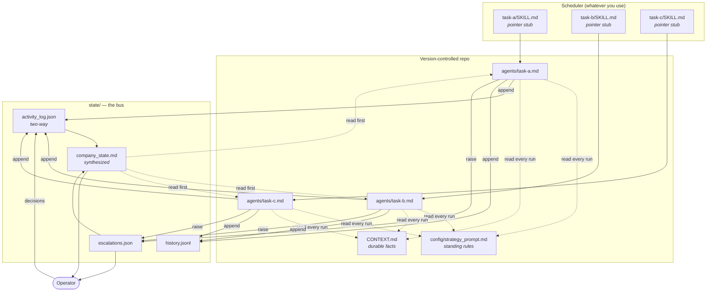
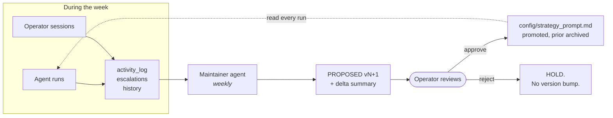

# agentic-ops-template

A template for running a fleet of scheduled AI agents as an operating company, rather than as a pile of disconnected automations.

The hard part of a multi-agent system is not the agents. It is everything around them: how they share state, how they escalate, how the operator stays in the loop without becoming the bottleneck, and how the rules they follow stay current as the business changes. This repo is the scaffolding for that, extracted from a fleet that has been running daily in production.

It ships empty. Every file is a pattern with placeholders, not a configuration to inherit.

---

## The problem this solves

A single scheduled agent is easy. Ten of them is a different thing:

- Agent A discovers something Agent B needed to know two hours ago.
- The operator asks "what happened overnight?" and the honest answer requires reading nine log files.
- Every agent re-derives the same company facts from raw sources, and they drift apart.
- A rule the operator stated in a chat session dies when the session ends.
- Prompts live inside a scheduler UI where they cannot be diffed, reviewed, or rolled back.
- An agent quietly starts doing something you did not authorise, and nobody notices for a week.

Each of those is a coordination failure, not a capability failure. The patterns below are the fixes.

---

## Architecture at a glance



Seven patterns hold it together. Each is independently useful; together they are the system.

---

## Pattern 1 — The state bus

**Problem:** agents cannot see each other. Without a shared surface they duplicate work, contradict each other, and act on stale facts.

**Solution:** one append-only log that every agent writes after every run and reads before every run.

`state/activity_log.json` is a list of entries, newest first:

```json
{
  "timestamp": "2026-01-15T14:30:00Z",
  "agent": "market-monitor",
  "run": 42,
  "action": "One-line summary of what this run did",
  "details": "Numbers, file paths, identifiers. Other agents reason from this field, so put the specifics here.",
  "affects": ["outreach", "procurement"],
  "decisions": [
    "chose X over Y because Z",
    "escalated rather than acting, because the threshold was ambiguous"
  ]
}
```

Three fields carry most of the weight:

- **`details`** is where the numbers go. An entry that says "scanned the market, found nothing" is worthless to the next agent. One that says "scanned 6 sources, 2 listings above threshold, both missing lead-time data, logged as incomplete" is actionable.
- **`affects`** is a routing hint. An agent scanning the log can filter to entries naming it.
- **`decisions`** is the audit trail. One or two judgment calls per run, in the form "chose X over Y because Z". This is what you diff after a model upgrade to see whether behaviour shifted. It costs almost nothing to write and it is the only cheap way to detect drift.

### The bus is two-way

This is the part most implementations miss. **Interactive sessions must write to the log too.**

If you have a conversation with an agent and it produces a real outcome — a document reaches send-ready state, you set a price, you commit to a deadline, you change an agent's instructions — that outcome exists only in a chat transcript unless something writes it down. The scheduled fleet reads the bus every run and will never see it.

The rule, stated as a standing instruction in every session:

> Any session that produces a consequential outcome MUST, before ending, prepend a schema-matched entry to `state/activity_log.json` and save deliverables under `outputs/<workstream>/`, not only in chat. If the session cannot reach the folder, output the ready-to-paste entry as its final message.

Without it you get one-way drift: sessions read fleet state and act on it, the fleet never learns what the sessions decided, and the two views of reality separate silently.

### Companion files

| File | Shape | Purpose |
|---|---|---|
| `state/activity_log.json` | JSON array, newest first | The bus. Cross-agent coordination. |
| `state/history.jsonl` | JSONL, append-only | Every run, including no-ops. Cheap and complete. Routine status goes here, not in escalations. |
| `state/escalations.json` | JSON array | Things needing a human. Severity + status + owner. |
| `state/company_state.md` | Markdown | Synthesized brief. See Pattern 3. |

Keep `history.jsonl` separate from `activity_log.json`. The log is for coordination and should stay readable; the history is for forensics and grows without bound. Rotate the history, never the log's recent window.

---

## Pattern 2 — Escalate, do not act

**Problem:** an autonomous agent that can act is an agent that can act wrongly, at 3am, unsupervised, in your name.

**Solution:** agents that touch money, external communication, or public surfaces run in OBSERVE mode. They research, evaluate, and draft. They do not send, buy, post, or commit.


Encode it as hard rules in the standing prompt, phrased as absolutes:

```
1. NEVER send external communications without human approval. Draft to state/drafts/.
2. NEVER post to public channels directly. Draft to outputs/content/.
3. NEVER make purchases or financial commitments.
4. DO research aggressively and autonomously.
5. DO draft and queue for review.
6. DO monitor continuously.
7. DO update state after every run.
8. ESCALATE uncertainty rather than guessing.
9. LOG everything.
```

Rules 4 through 6 matter as much as 1 through 3. An agent that escalates everything is as useless as one that acts on everything; the goal is a clean line, not caution everywhere.

### Escalation hygiene

Escalations are for things that need a decision. A cycle summary is not an escalation. If everything is escalated, the operator stops reading, and the one that mattered gets missed.

Define the escalation triggers explicitly in the standing prompt: a deal meets pre-agreed criteria, a regulatory change lands, a counterparty replies, a deadline falls inside a window, content is ready to publish, or the agent genuinely cannot tell whether it should act. Everything else goes to `history.jsonl`.

**Backpressure.** Add a gate: if more than N items are already awaiting approval, the agent stops generating new ones and says so. Without it, a drafting agent will happily produce two hundred drafts nobody has read. The gate should be stated as a number the agent checks before drafting, with a named exception for genuinely time-sensitive items.

---

## Pattern 3 — The synthesized brief

**Problem:** every agent reading the raw log every run means every agent re-derives the same picture, spends tokens doing it, and reaches slightly different conclusions.

**Solution:** one agent, once a day, reads everything and writes the picture down. Everyone else reads that first.

`state/company_state.md` is maintained by the briefing agent and holds:

- Current priorities, with owners
- Active workstreams and their status
- **Canonical facts** — the numbers that must not drift. Whatever your equivalents are of headcount, budget, key dates, current version numbers.
- Open blockers
- What changed in the last 24 hours

Then every other agent's prompt opens with:

> Begin each run by reading `state/company_state.md`. It is the shared picture of where things stand. Read it first, then scan `state/activity_log.json` for anything since it was written.

Two effects. Agents stop carrying stale numbers, because there is one place the number lives. And the operator gets a readable digest as a side effect of a thing the fleet needed anyway.

The briefing agent is also the natural place to fold in operator decisions from interactive sessions, so they reach the fleet within a day rather than never.

---

## Pattern 4 — Pointer stubs

**Problem:** scheduler UIs store the prompt inside the task. That means the prompt cannot be diffed, reviewed, or rolled back, and any session that cannot reach the scheduler's storage cannot edit it. If you keep a copy in git for reviewability, you now have two copies, and they drift.

**Solution:** invert it. The repo holds the real prompt. The scheduled task holds a pointer.

`agents/_pointer-stub.md` is the pattern. The live task file becomes:

```markdown
---
name: <task-id>
description: <preserved verbatim from the original task>
---

This agent's canonical prompt lives at `<ABSOLUTE_PATH>/agents/<task-id>.md`. Read that file now and execute it as your complete instructions for this run. If the file is unreachable, write a CRITICAL escalation to `<ABSOLUTE_PATH>/state/escalations.json` describing the failure and stop without doing other work.
```

Three details that are not optional:

1. **Preserve the frontmatter verbatim.** Schedulers key off `name` and display `description`. Rewriting them changes what the task looks like in the UI.
2. **Include the failure branch.** A stub that silently no-ops when the file is missing looks exactly like a healthy quiet run. You will not notice for weeks.
3. **Use an absolute path.** The agent's working directory is whatever the scheduler decides.

Now prompt changes are commits. They diff, they review, they revert, and any session that can reach the repo can make them.

### The drift-check duty

Editing a task through the scheduler UI will overwrite the stub with a full prompt and silently re-fork the two copies. Assume this will happen, and check for it on a schedule:

```bash
for d in <TASK_DIR>/*/; do
  id="${d%/}"; f="$id/SKILL.md"
  n=$(wc -l < "$f" | tr -d ' ')
  if [ "$n" -gt 10 ] || ! grep -q "agents/$(basename $id).md" "$f"; then
    echo "DRIFT: $id ($n lines)"
  fi
done
```

**Do not auto-re-stub.** A grown file is somebody's real edit and is the only copy of it. Diff it against the canonical, escalate, and let a human decide what merges back. Auto-repair here destroys work.

---

## Pattern 5 — Standing rules, and the loop that keeps them current

**Problem:** the rules an agent must follow are not in the agent. They are in the business, and the business changes weekly. Editing twelve prompts every time a rule changes does not happen, so the prompts rot.

**Solution:** separate the standing rules from the task instructions, and give the rules their own maintenance loop.



`config/strategy_prompt.TEMPLATE.md` is the skeleton. It holds what every agent needs and no agent should restate: role, operating mode, workstreams and priorities, cross-agent awareness, anti-patterns, voice and vocabulary discipline, source-verification rules, cadence.

`routines/maintainer.md` is the agent that keeps it fresh. Once a week it reads the log, the escalations, the briefings, and the agent prompts, identifies what changed, and writes a **proposed** version bump plus a delta summary. It never edits the canonical file. The operator promotes it.

Four rules make this work rather than generate noise:

- **Surgical edits, not rewrites.** Most weeks are small. Do not rewrite sections that did not change.
- **HOLD is a valid output.** A week with no material deltas gets no version bump. Version churn for its own sake burns the operator's review attention, which is the scarcest resource in the system.
- **Cite the source for every delta.** "Added rule X because incident Y on date Z." A proposal you cannot trace is a proposal you cannot evaluate.
- **The operator promotes, never the agent.** Promotion is a rename plus an archive of the prior version, done deliberately.

### Anti-patterns are the memory

The most valuable section of the standing prompt is a numbered, append-only list of specific mistakes and their corrections. Not "be accurate" — the actual failure, the actual rule.

Generic form, with a real shape:

> **#N. Quoting a metric from a state file without reconciling it against the source of record.** [What happened, in one sentence, with the magnitude of the error.] **Rule:** before any metric enters an external document, reconcile the stored value against its source and state which convention is in use.

Numbered so agents can cite them ("held this draft under #N"). Append-only so the numbering stays a stable reference. Each one is a scar, and the list is the only part of the system that gets monotonically more valuable.

### Keeping the human-facing prompt in sync

If you also maintain a resume prompt — the block you paste into a fresh interactive session so it loads standing rules immediately — it drifts from the agent-facing rules unless something syncs it.

Give the maintainer explicit triggers rather than syncing every week. Something like: vocabulary discipline changed, identity or citation rules changed, a new anti-pattern was added, naming conventions changed, confidentiality rules changed, or canonical file paths moved. If none fired, do not propose an update. The resume prompt should be stable; weekly cosmetic churn trains the operator to skim it.

---

## Pattern 6 — Source-of-truth precedence

**Problem:** four files disagree about the same fact and each agent picks a different one.

**Solution:** a written, ordered precedence, plus one rule about what agents must never do.

1. The operator's direct words in the current session
2. Written captures of operator decisions from interactive sessions
3. The durable context document (`CONTEXT.md` or equivalent)
4. Long-form memory files
5. State files, agent outputs, briefings

Higher wins. Within a tier, newer wins.

The rule that matters: **an agent must never "correct" a newer operator decision against older canon.** A capture that contradicts the context document is newer intent with the canon pending update, not an error to be fixed. Agents flag the conflict; they do not revert it. Without this rule, a diligent agent will helpfully undo the operator's most recent decision and cite the documentation while doing it.

The maintainer loop closes the gap: captures get merged into canon weekly and marked as merged, so the precedence list stays short in practice.

---

## Pattern 7 — Guard nodes and the audit chain

**Problem:** the failure mode that actually hurts is not an agent that errors. It is an agent that succeeds with a wrong value, which then flows through the bus into every downstream decision. And when a number is wrong in your canonical context, freshness checks do not help: the wrong value is brand new.

**Solution:** two small scripts with no dependencies, run on a schedule.

**`scripts/validate_state.py`** is the guard node. It checks three classes of invariant that are nearly free to assert and catch most confidently-wrong values:

- **Shape.** Every load-bearing state file parses, recent log entries carry their required fields, enum fields hold known values.
- **Magnitude.** Key metrics may not move more than ±25% between checks, and may not fall below a floor they genuinely cannot reach. A test suite does not shrink 91% overnight; a parse bug does that.
- **Monotonicity.** Run counters only go up. A counter that went backwards is a sync failure, not history.

The baseline updates only for values that passed, so a bad value cannot poison the next comparison. Findings are escalated, never auto-corrected — the source of record is reconciled by a human, because the guard cannot know which side is wrong.

This pattern earned its place the hard way: the fleet this template is extracted from shipped a metric at 9% of its true value into its canonical context file, through an automated sync, with a fresh timestamp. A staleness check passed it. A magnitude check would have stopped it in the same second.

**`scripts/audit_chain.py`** makes the decision log tamper-evident. Every activity-log entry is sealed into an append-only SHA-256 hash chain — each record links to the previous, so any later mutation, deletion, or reordering of sealed history breaks verification from that point forward. `seal` is idempotent and runs from the weekly routine; `verify` proves the chain in milliseconds and its output is something you can hand to an auditor.

Be precise about what the chain proves: that the recorded history has not been altered since sealing. It does not prove an entry was *true* when written — that is what the source-citation rules in the standing prompt are for. The two compose: citations make entries trustworthy going in, the chain keeps them trustworthy afterwards. See `GOVERNANCE.md` for how this maps to record-keeping expectations in common compliance frameworks, and for the claims you should not make.

---

## Repo layout

```
.
├── README.md                          this document
├── CONTEXT.md                         durable facts. Create from your own context.
├── agents/
│   ├── _pointer-stub.md               the stub pattern, with placeholders
│   └── example-market-monitor.md      one fully worked agent
├── config/
│   └── strategy_prompt.TEMPLATE.md    standing-rules skeleton
├── routines/
│   └── maintainer.md                  the weekly rules-maintenance agent
├── state/
│   └── schemas/
│       ├── SCHEMA.md                  what each file is for and who writes it
│       ├── activity_log.schema.json
│       ├── escalations.schema.json
│       ├── outreach_tracker.schema.json
│       └── market_state.schema.json
├── GOVERNANCE.md                      what the audit layer does and does not prove
└── scripts/
    ├── validate_state.py              guard node: shape, magnitude, monotonicity
    ├── audit_chain.py                 tamper-evident SHA-256 chain over the log
    ├── rotate_state.py                tiered compression of state backups
    └── build_letterhead_pdf.py        HTML to PDF with correct footer placement
```

---

## Getting started

1. **Write `CONTEXT.md` first.** Durable facts about your operation: what it is, who the people are, what the current priorities are, what the naming and voice conventions are. Everything else reads this. It is the highest-leverage file in the repo and the one nobody wants to write.
2. **Fill in `config/strategy_prompt.TEMPLATE.md`.** Rename it, drop the placeholders you do not need. Leave the anti-patterns section empty; it fills itself in as things go wrong.
3. **Copy `agents/example-market-monitor.md`** and adapt it into your first real agent. Keep the STEP structure. Keep STEP 0.
4. **Create the state files empty** — `[]` for the arrays, `{}` for the trackers — and let the agents populate them.
5. **Point your scheduler at the agent file** using the stub in `agents/_pointer-stub.md`. Verify with one low-stakes task before converting the rest. Check that the run output actually shows the agent reading the canonical file.
6. **Add the maintainer last**, once you have two or three weeks of log to maintain against. Before that it has nothing to work with.

Start with two agents, not ten. The coordination patterns only pay for themselves once agents genuinely need to know what the others did, and you will not know what your real workstreams are until you have run a few.

---

## What this template deliberately does not include

No orchestration framework, no runtime, no dependencies. The patterns are file conventions and prompt structure, and they work with any scheduler that can run an agent on a cron and any agent that can read and write files.

That is the point. The valuable part was never the code.
